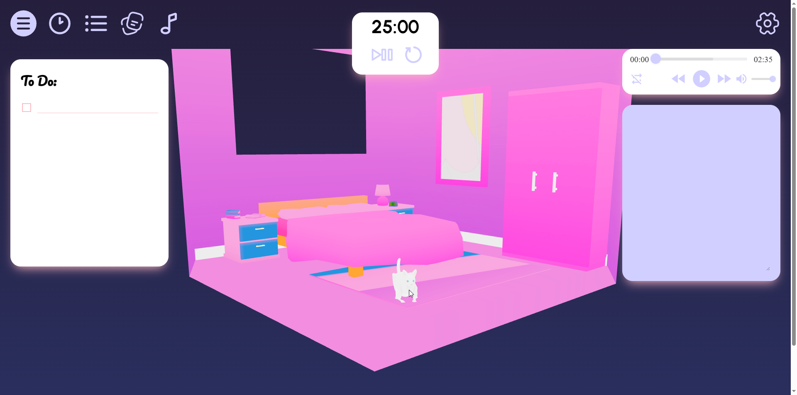

# Catpanion



[🐱 Link to Catpanion 🐱](https://catpanion.netlify.app/ "Catpanion's Homepage")

## Overview

This is a 3D pet productivity app with common tools provided to enhance the user's work session experience.

### Problem Space

Productivity apps are mundane these days and lack creative direction. On the other hand, people miss their cats that passed away or by working away from home. Bridging these two problems together resolves the absence of companionship whilst making work fun.

### Features

- 3D Experience in a bedroom-like setting, with an interactive pet inside the scene
- Tools: Todo list, Notes, Pomodoro Timer
- Music Player: Can access a lofi-themed playlist

### Installation

```
npm i
npm run dev

```

## Implementation

### Tech Stack

React, React Three Fiber, Express, NodeJS, HTML, SCSS, Javascript, MySQL

### Sitemap

- Homepage - All the features are accessed in one single page.

## Roadmap

- Rebuild database to POSTGres
- Change cat's appearance
- Make notes screen larger
- Custom animations and models built from scratch
- Clock linked to person's location
- Calculator as part of tools
- Color themes
- Light/Dark Mode
- Import Calendar
- Note Pages
- Settings icon for top right
- Based on user time, environment from the window will turn day or night
- Speech recognition to get the cat's attention and call them by their name
- Option to add up to 3 cats in the 3D scene
