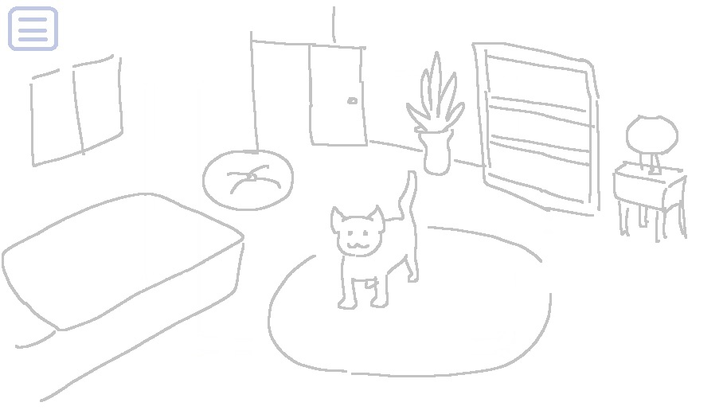
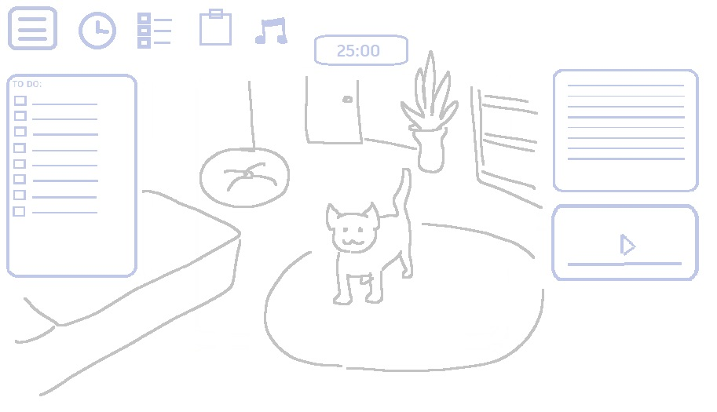

# Catpanion

## Overview

This is a 3D pet productivity app with common tools provided to enhance the user's work session experience.

### Problem Space

Productivity apps are mundane these days and lack creative direction. On the other hand, people miss their cats that passed away or by working away from home. Bridging these two problems together resolves the absence of companionship whilst making work fun.

### User Profile

Users who want a stress-free, relaxing productivity app where they can enjoy the benefits of tools in one at their convenience, with the addition of having a virtual pet (cat) to accompany them.

### Features

- 3D Experience in a bedroom-like setting, with an interactive pet inside the space
- Tools: Todo list, Notes, Pomodoro Timer
- Music Player: Can access a lofi-themed playlist

## Implementation

### Tech Stack

Libraries: React, React three fiber
Components: React h5 Audio player, React-calendar
Frameworks: Express
Languages: HTML, CSS, Javascript
Database: MySQL

### Sitemap

- Homepage - All the features are accessed in one single page.

### Mockups

Upon opening the site, the tabs are closed

With tabs and tools open

### Data

### Endpoints

`/`
`/:id`

## Roadmap

1. Build repository for client and server and initialize for both
2. Create React App
3. Create To do List
4. Create Notes Component
5. Create Pomodoro Component
6. Create 3D component, import three js fiber library
7. Import 3D objects, animations and rigging (from market)
8. Create idle state, walking, sitting, and playing
9. Create music player component with React H5 audio player, customize design
10. Build furniture, add to setting of 3D
11. Build database in MySQL
12. Connect database to front-end
13. Deploy front-end to netlify, back-end to heroku

## Future Implementations

- Make notes screen larger
- Custom animations and models built from scratch
- Clock linked to person's location
- Calculator as part of tools
- Color themes
- Light/Dark Mode
- Import Calendar
- Note Pages
- Settings icon for top right
- Based on user time, environment from the window will turn day or night
- Speech recognition to get the cat's attention and call them by their name
- Option to add up to 3 cats in the 3D scene
